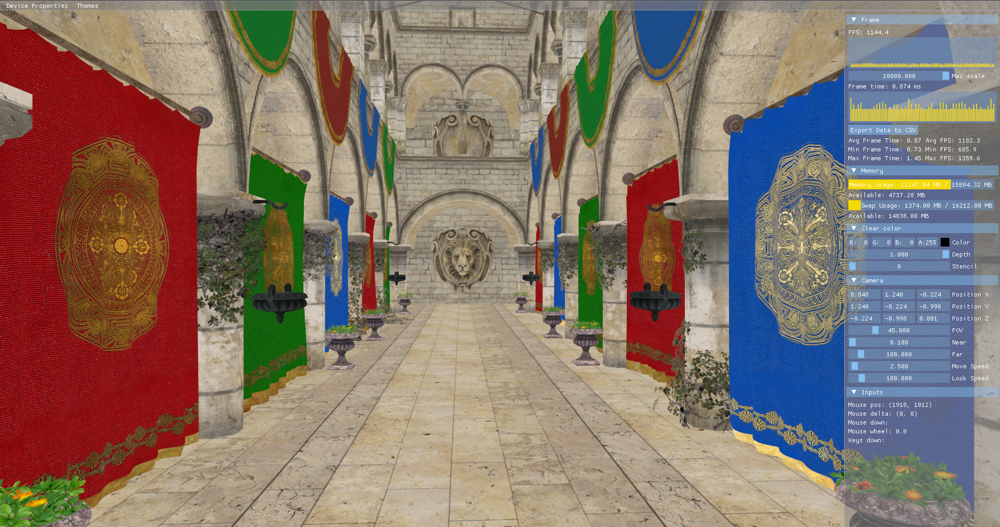

[](https://github.com/bobis33/VEngine-2.0/blob/main/LICENSE)


# VEngine-2.0

https://docs.vulkan.org/tutorial/latest

https://docs.vulkan.org/samples/latest/README.html



## Prerequisites

Make sure you have the following dependencies installed on your system:

- [CMake 3.30](https://cmake.org/)
- [C++20](https://en.cppreference.com/w/cpp/20)
- [Vulkan SDK](https://www.vulkan.org/)
- [X11](https://www.x.org/wiki/) (Linux only)
- [LLVM](https://llvm.org/)

If you are using a Debian-based distribution, you can install the dependencies using the following command:

```bash
./tools/install-dependencies.sh build
```

## Key Bindings

The following keyboard controls are currently available for interacting with the engine:

| Key     | Description        |
|:--------|:-------------------|
| `Z`     | Move forward       |
| `S`     | Move backward      |
| `Q`     | Move left          |
| `D`     | Move right         |
| `SHIFT` | Move down          |
| `SPACE` | Move up            |
| `↑`     | Look up            |
| `↓`     | Look down          |
| `←`     | Look left          |
| `→`     | Look right         |
| `à`     | Show debug windows |


## External Libraries

- [**Assimp**](https://github.com/assimp/assimp): Open Asset Import Library to load various 3D model formats into the engine.
- [**Doxygen Awesome CSS**](https://github.com/jothepro/doxygen-awesome-css): A custom CSS theme for Doxygen documentation.
- [**GLFW**](https://github.com/glfw/glfw): For creating windows, receiving input, and managing OpenGL and Vulkan contexts.
- [**GLM**](https://github.com/g-truc/glm): A header-only C++ mathematics library for 3D transformations, vectors, and matrices, compatible with OpenGL and Vulkan.
- [**Google Test**](https://github.com/google/googletest): A testing framework for C++.
- [**ImGui**](https://github.com/ocornut/imgui): Immediate Mode Graphical User Interface for real-time debugging and tool development.
- [**stb**](https://github.com/nothings/stb): A set of single-file public domain libraries for graphics, image loading, and more.

These libraries are included directly into the project to simplify dependency management. Be sure to initialize and update the submodules when cloning the repository:


## Commit Norms

| Commit Type | Description                                                                                                               |
|:------------|:--------------------------------------------------------------------------------------------------------------------------|
| build       | Changes that affect the build system or external dependencies (npm, make, etc.)                                           |
| ci          | Changes related to integration files and scripts or configuration (Travis, Ansible, BrowserStack, etc.)                   |
| feat        | Addition of a new feature                                                                                                 |
| fix         | Bug fix                                                                                                                   |
| perf        | Performance improvements                                                                                                  |
| refactor    | Modification that neither adds a new feature nor improves performance                                                     |
| style       | Change that does not affect functionality or semantics (indentation, formatting, adding space, renaming a variable, etc.) |
| docs        | Writing or updating documentation                                                                                         |
| test        | Addition or modification of tests                                                                                         |


## License

This project is licensed under the MIT License - see the [LICENSE](https://github.com/bobis33/VEngine-2.0/blob/main/LICENSE.md) file for details.


## Acknowledgements

[Sascha Willems](https://github.com/SaschaWillems/Vulkan) - [Blog](https://www.saschawillems.de/)

[Brendan Galea](https://github.com/blurrypiano/littleVulkanEngine) - [YouTube channel](https://www.youtube.com/c/BrendanGalea)

[Beaumanvienna](https://github.com/beaumanvienna/vulkan) - [YouTube channel](https://www.youtube.com/@beaumanvienna6844)

[Maria beketova](https://github.com/svatostop/anthrax-ai) - [YouTube channel](https://www.youtube.com/@sudolovemebaby)